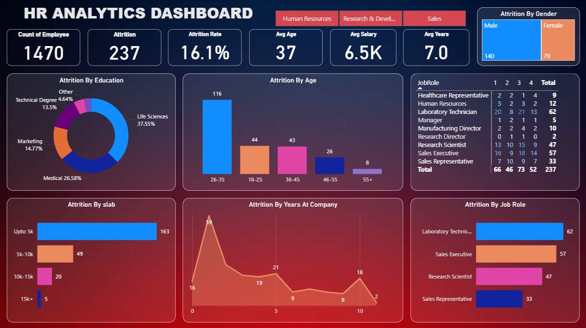

# 👥 HR Analytics Dashboard  
### Workforce Attrition & Retention Analysis  
**By Punit Pal**

---

## 📊 Dashboard Preview

---

## 📌 Project Overview

This HR Analytics Dashboard is designed to analyze employee attrition patterns and provide actionable insights for improving workforce retention.

The project transforms employee-level data into a clear executive summary that helps HR teams and management understand:

- Overall attrition rate  
- High-risk employee segments  
- Department & role-wise attrition  
- Salary and experience impact on attrition  
- Workforce stability trends  

---

## 🎯 Key Business Metrics

- Total Employees: **1470**
- Total Attrition: **237**
- Attrition Rate: **16.1%**
- Average Age: **37 years**
- Average Salary: **6.5K**
- Average Tenure: **7 years**

---

## 🔍 Core Insights

- Highest attrition observed in the **26–35 age group**
- Employees in **lower salary slabs** show significantly higher attrition
- Specific job roles such as **Laboratory Technician and Sales Executive** have elevated attrition
- Majority of attrition occurs in the **early years of employment**
- Male attrition slightly higher than female

These patterns indicate that compensation, early-career engagement, and role-specific challenges influence employee turnover.

---

## 💡 Strategic Recommendations

- Strengthen onboarding and early-career engagement programs  
- Review salary structure for lower pay bands  
- Implement targeted retention strategies for high-risk job roles  
- Improve internal growth & promotion pathways  
- Enhance employee satisfaction and work-life balance initiatives  

---

## 🛠 Tools & Skills Applied

- Power BI (Dashboard Development)
- Data Cleaning & Transformation
- Data Visualization
- Business Interpretation of HR Data
- Analytical Thinking

---

## 🎯 Business Impact

This dashboard enables organizations to:

- Identify attrition drivers  
- Reduce turnover costs  
- Improve workforce planning  
- Enhance retention strategy  
- Support data-driven HR decisions  

---

## 👨‍💻 About Me

**Punit Pal**  
Aspiring Data Analyst | Power BI | Excel | SQL  | Python | Google Sheets

Passionate about turning raw data into meaningful business insights.  
Open to internships and entry-level Data Analyst opportunities.
